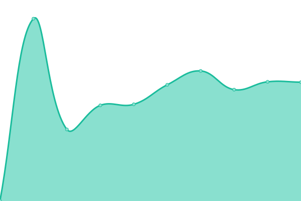
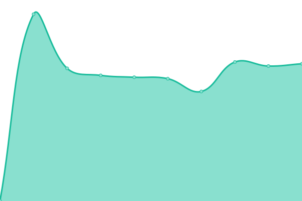
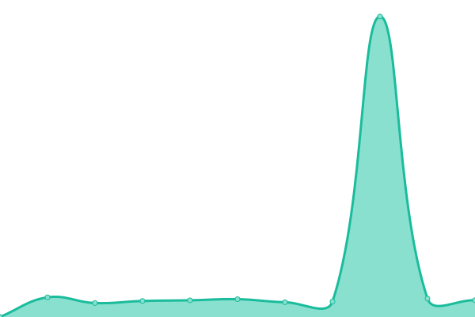
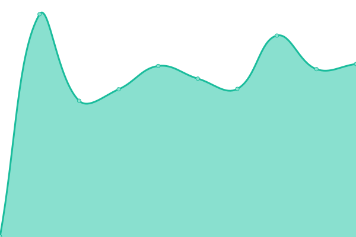
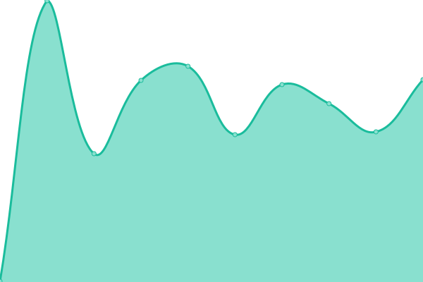

# [📈 Live Status](https://status.powerio.com): <!--live status--> **🟧 Partial outage**

This repository contains the open-source uptime monitor and status page for [powerIO-GmbH](https://www.powerio.com), powered by [Upptime](https://github.com/upptime/upptime).

With [Upptime](https://upptime.js.org), you can get your own unlimited and free uptime monitor and status page, powered entirely by a GitHub repository. We use [Issues](https://github.com/powerIO-GmbH/uptime/issues) as incident reports, [Actions](https://github.com/powerIO-GmbH/uptime/actions) as uptime monitors, and [Pages](https://status.powerio.com) for the status page.

<!--start: status pages-->
<!-- This summary is generated by Upptime (https://github.com/upptime/upptime) -->
<!-- Do not edit this manually, your changes will be overwritten -->
<!-- prettier-ignore -->
| URL | Status | History | Response Time | Uptime |
| --- | ------ | ------- | ------------- | ------ |
|  [powerIO Website](https://powerio.com) | 🟩 Up | [power-io-website.yml](https://github.com/powerIO-GmbH/uptime/commits/HEAD/history/power-io-website.yml) | 

 661ms
     
 | 

<a href="https://status.powerio.com/history/power-io-website">100.00%</a>
    

|  [powerIO HVAC Automation Portal](https://portal.hvac-automation.com) | 🟩 Up | [power-io-hvac-automation-portal.yml](https://github.com/powerIO-GmbH/uptime/commits/HEAD/history/power-io-hvac-automation-portal.yml) | 

 642ms
     
 | 

<a href="https://status.powerio.com/history/power-io-hvac-automation-portal">100.00%</a>
    

|  [powerIO Customer Portal](https://portal.powerio.com) | 🟩 Up | [power-io-customer-portal.yml](https://github.com/powerIO-GmbH/uptime/commits/HEAD/history/power-io-customer-portal.yml) | 

 1021ms
     
 | 

<a href="https://status.powerio.com/history/power-io-customer-portal">100.00%</a>
    

|  [powerIO Online Shop](https://shop.powerio.com) | 🟥 Down | [power-io-online-shop.yml](https://github.com/powerIO-GmbH/uptime/commits/HEAD/history/power-io-online-shop.yml) | 

 622ms
     
 | 

<a href="https://status.powerio.com/history/power-io-online-shop">100.00%</a>
    

|  [powerIO support Hub](https://support.powerio.com) | 🟩 Up | [power-io-support-hub.yml](https://github.com/powerIO-GmbH/uptime/commits/HEAD/history/power-io-support-hub.yml) | 

 563ms
     
 | 

<a href="https://status.powerio.com/history/power-io-support-hub">100.00%</a>
    

|  [powerIO Dip Switch Tool](https://dipswitch.powerio.com) | 🟩 Up | [power-io-dip-switch-tool.yml](https://github.com/powerIO-GmbH/uptime/commits/HEAD/history/power-io-dip-switch-tool.yml) | 

 275ms
     
 | 

<a href="https://status.powerio.com/history/power-io-dip-switch-tool">100.00%</a>
    

<!--end: status pages-->

[**Visit our status website →**](https://status.powerio.com)

## 📄 License

- Powered by: [Upptime](https://github.com/upptime/upptime)
- Code: [MIT](./LICENSE) © [Anand Chowdhary](https://anandchowdhary.com), supported by [Pabio](https://pabio.com)
- Data in the `./history` directory: [Open Database License](https://opendatacommons.org/licenses/odbl/1-0/)
